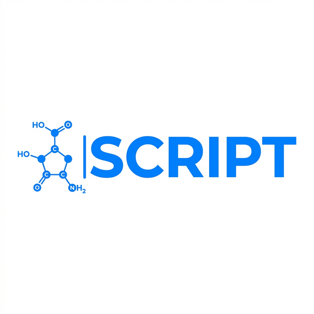

# SCRIPT: Structural Chemical Representation In Plain Text

<p align="center">
  
</p>

**SCRIPT** is a deterministic, sovereign molecular notation system and RDKit-independent cheminformatics engine. Built on a Paninian linguistic model, SCRIPT provides a "one true string" for every molecule, reaction, material, and quantum state with 100% native round-trip consistency.

---

## Why SCRIPT?

SMILES has served chemistry for 35 years, but its limitations are critical for modern AI/ML and materials science applications:

- **Non-canonical**: Same molecule = multiple valid SMILES strings
- **Ambiguous rings**: Global ring labels (`C1...C1`) create parsing complexity
- **Stereochemistry fragility**: Neighbor ordering affects chirality interpretation
- **No validation**: Invalid strings parse without error
- **No materials support**: SMILES cannot express alloys, surfaces, or quantum states

SCRIPT addresses all of these systematically:

| Problem | SMILES | SCRIPT V3 |
|---------|--------|-----------|
| Canonicalization | Multiple valid strings | Path-invariant DFS traversal |
| Ring notation | Global labels `C1...C1` | Topological `&N:` (invariant size) |
| Aromaticity | `c1ccccc1` (lowercase hack) | Anubandha `:` (Grammar state) |
| Tautomers | Multiple forms | Mobile `=:` (Unified form) |
| Validation | Post-hoc | Generative state machine (Sandhi) |
| Organometallics | Partial | Dative `->`, Coordinate `>`, Haptic `*n` |
| Alloys | Not supported | Fractional occupancy `<~0.9>` |
| Crystallography | Not supported | Macroscopic context `[[Rutile]]` |
| Surfaces | Not supported | Phase boundary `\|` |
| Quantum states | Not supported | Spin/excitation `<s:3>`, `<*>` |
| Polymers | Not supported | Stochastic chains `{[CC]}n` |

---

## Core Innovations

### 1. Deterministic Canonicalization
Morgan-invariant ranking with DFS traversal ensures every molecule has exactly one canonical SCRIPT string.

```
SMILES: CC(=O)Oc1ccccc1C(=O)O  (or many others)
SCRIPT: CC(=O)OC1=CC=CC=C1C(=O)O  (one and only one)
```

### 2. Topological Back-counting (`&N`)
Ring closure index `&6:` is an instruction ("connect 6 atoms back along the DFS path"), not a global label.

```
SMILES:  C1CCCCC1      # Global label
SCRIPT:  C1CCCCC&6.    # Topological: connect 5 atoms back, aliphatic
SCRIPT (benzene): C1=CC=CC=C&6:   # Aromatic anubandha
```

### 3. Paninian Stereochemistry (Vak Order)
Chirality is resolved using the DFS sequence order as the native coordinate frame.

```
C[C@H](O)C(=O)O      # L-Lactic Acid
# Order: [parent, H, O, C(=O)O] -> @ = CCW in Vak space
```

### 4. Sandhi Validation
Generative state machine catches invalid structures during parsing.

```
# C(C)(C)(C)(C)(C) -> Rejected: 6-valent carbon
```

### 5. RDKit-Independent Core
Zero dependencies for core operations. RDKit is optional for interop only.

---

## V3: Materials & State Expansion

### Alloys & Non-Stoichiometry (`~FLOAT`)
```
Ti<~0.9>N<~0.1>    # Doped Titanium Nitride
Fe<~0.5>Ni<~0.5>   # Iron-Nickel alloy
```

### Crystallography & Polymorphs (`[[ ]]`)
```
[[Rutile]] Ti(O)2   # TiO2 in Rutile phase
[[Anatase]] Ti(O)2  # Same formula, different structure
[[bcc]] Fe          # Ferrite (body-centered cubic)
[[fcc]] Fe          # Austenite (face-centered cubic)
```

### Surface & Interface Chemistry (`|`)
```
[[Pt_111]] | >C=O   # CO adsorbed on Platinum 111 surface
[[LiCoO2]] | Li<+>  # Li-ion in LiCoO2 battery lattice
```

### Electronic & Excited States (`s:INT`, `*`)
```
O=O<s:3>       # Triplet oxygen (ground state diradical)
O=O<s:1,*>     # Singlet oxygen (excited state)
```

### Polymers & Stochastic Chains (`{[ ]}`)
```
{[CC]}n              # Polyethylene
{[CC]}<n:50-100>     # Stochastic PE, 50-100 units
```

### The "Boss Fights" (Stress Tests)

To prove that the **Topological Back-counting** and **Anubandha** systems scale to real-world complexity, SCRIPT was validated against these high-complexity scaffolds:

- **Taxol (Paclitaxel)**: 11 stereocenters, fused/bridged system.
  - `TAXOL: O[C@H]C[C@H]([C@@](C)C([C@H](OC(C)=O)C=C([C@@H](C[C@H]([C@H](OC(C:C:C:C:C:C&6:)=O)[C@H]&10.[C@]&14.(OC(=O)C)C&16.)C&6.(C)C)OC([C@H]([C@@H](C:C:C:C:C:C&6:)NC(C:C:C:C:C:C&6:)=O)O)=O)C)=O)O`
  
- **Strychnine**: Dense polycyclic structure.
  - `STRYCHNINE: O=CNCCCCN(CCC&10.)CC=C&5.OCC&10.C&6.(C=&13.C=CC=C&18.)CC&5.C=C`

---

## Benchmark Results

- **100% native round-trip** (SCRIPT -> CoreMolecule -> SCRIPT)
- **95.9% RDKit InChI parity** on 100-compound diverse dataset
- **22/22 V3 Materials tests passing**

```bash
python benchmark.py
# Round-trip: 95.9%  (99 compounds passing)

python test_v3.py
# TOTAL: 22 passed, 0 failed out of 22
```

---

## Installation

```bash
# Core engine (RDKit-free)
pip install lark

# With RDKit bridge for interop
pip install rdkit
```

---

## Quick Start

### Parsing & Canonicalization

```python
from script.parser import SCRIPTParser
from script.canonical import SCRIPTCanonicalizer

parser = SCRIPTParser()
result = parser.parse("CC(=O)OC1=CC=CC=C1C(=O)O")
mol = result["molecule"]

print(f"Atoms: {len(mol.atoms)}")
print(f"Bonds: {len(mol.bonds)}")

# Canonicalize CoreMolecule to SCRIPT string
canonicalizer = SCRIPTCanonicalizer()
script_str = canonicalizer.canonicalize_core(mol)
print(f"Canonical: {script_str}")
```

### Materials Science (V3)

```python
parser = SCRIPTParser()

# Alloy - get fractional occupancy
res = parser.parse("Ti<~0.9>N<~0.1>")
mol = res["molecule"]
print(mol.atoms[0].occupancy)  # 0.9

# Crystallographic context
res = parser.parse("[[Rutile]] Ti(O)2")
mol = res["molecule"]
print(mol.macroscopic_context)  # "Rutile"

# Surface adsorption
res = parser.parse("[[Pt_111]] | >C=O")
print(res["success"])  # True

# Electronic state
res = parser.parse("O=O<s:3>")
mol = res["molecule"]
print(mol.atoms[-1].spin)  # 3
```

### Reactions & Atom Mapping

```python
# Reaction with atom-to-atom mapping
res = parser.parse("[C:1]OCO>>[C:1]O")

# Salt / solvent system
res = parser.parse("[Na+].[Cl-]")   # NaCl
```

### Peptides & Polymers

```python
parser.parse("{A.G.S[A]K}")         # Ala-Gly-Ser-Lys with disulfide bridge
parser.parse("{[CC]}n")             # Polyethylene
parser.parse("{[CC]}<n:50-100>")    # Stochastic PE, 50-100 units
```

### RDKit Interop

```python
from rdkit import Chem
from script.rdkit_bridge import SCRIPTFromMol, MolFromSCRIPT

mol = Chem.MolFromSmiles("CC(=O)Oc1ccccc1C(=O)O")
script_str = SCRIPTFromMol(mol)
print(f"SCRIPT: {script_str}")

mol_back = MolFromSCRIPT(script_str)
inchi = Chem.MolToInchi(mol_back)
```

---

## Project Structure

```
script-notation/
├── script/                    # Core engine (RDKit-free)
│   ├── mol.py                 # CoreAtom / CoreBond / CoreMolecule (V3 fields)
│   ├── parser.py              # Lark-based SCRIPT parser (V3 interpreter)
│   ├── canonical.py           # DFS canonicalization engine
│   ├── chiral.py              # Stereochemistry perception
│   ├── cip.py                 # CIP priority calculator
│   ├── state_machine.py       # Sandhi validation (Generative)
│   ├── writer.py              # Native SCRIPT string writer
│   ├── grammar.lark           # SCRIPT V3 LALR grammar
│   ├── ranking.py             # Morgan invariant ranking
│   ├── local_rings.py         # Topological ring resolution
│   └── rdkit_bridge.py        # Optional RDKit interop
├── docs/                      # All documentation (domain guides + deep-dives)
│   ├── organic_aromatic_stereo.md
│   ├── metals_organometallics.md
│   ├── materials_polymers_states.md
│   ├── reactions_salts_radicals.md
│   ├── SPEC.md                # Complete SCRIPT specification
│   ├── CIP_STEREO_THEORY.md   # Stereochemistry reconciliation theory
│   └── STANDALONE_ARCHITECTURE.md
├── tests/
│   ├── test_parser.py
│   └── test_rdkit_integration.py
├── examples/
│   ├── basic_usage.py
│   └── rdkit_demo.py
├── benchmark.py               # 100-compound RDKit round-trip validation
├── test_v3.py                 # V3 materials test suite (22 cases)
└── LICENSE                    # MIT + Commons Clause
```

---

## Grammar Summary

```
start:          macroscopic_structure
macroscopic_structure: [[context]]? (reaction|script) (| (reaction|script))*
reaction:       script (>> | =>) script
script:         component (. | ~ component)*
component:      molecular_chain | peptide_chain | polymer | ring_closure
molecular_chain: bond? atom_expr (bond? (atom_expr | local_ring | branch))*
atom_expr:      (ELEMENT | [bracket_atom] | ATOM<state_block>) multiplier?
state_block:    < INT | CHARGE | GEOMETRY | h INT | m | ~FLOAT | s:INT | * >
bond:           -> | <- | - | = | # | : | =: | / | \ | > | *INT?
ring_closure:   &INT (: | .)
polymer:        {[ unit ]} (<n:INT> | <n:INT-INT> | n)?
peptide_chain:  { AMINO_ACID (. AMINO_ACID)* }
```

---

## Comparison with Existing Notations

| Feature | SMILES | SELFIES | InChI | SCRIPT V3 |
|---------|--------|---------|-------|-----------|
| Canonical | No* | No | Yes | Yes |
| Human-readable | Yes | No | No | Yes |
| Invalid-proof | No | Yes | N/A | Yes (Sandhi) |
| Stereochemistry | Fragile | Limited | Robust | Robust (Vak+CIP) |
| Organometallics | Partial | No | No | Yes |
| Alloys | No | No | No | Yes |
| Crystallography | No | No | Partial | Yes |
| Surfaces | No | No | No | Yes |
| Quantum states | No | No | No | Yes |
| Polymers | No | No | No | Yes |
| RDKit-free core | No | No | N/A | Yes |

---

## Citation

```
Sharma, S. (2026). SCRIPT: Structural Chemical Representation in Plain Text.
A Deterministic Molecular Notation System with Materials & State Expansion (V3).
https://github.com/sangeet01/script
```

---

## License

**MIT License with Commons Clause**

Free for academic research, personal projects, and non-commercial open-source development. Commercial use requires a separate licensing agreement.

See `LICENSE` for full terms.

---

## Contact

Developed by **Sangeet Sharma** and the SCRIPT team.

- GitHub Issues: [sangeet01/script/issues](https://github.com/sangeet01/script/issues)
- Documentation: See `docs/` directory


---

PS: Sangeet's the name, a daft undergrad splashing through chemistry and code like a toddler; my titrations are a mess, and I've used my mouth to pipette.
