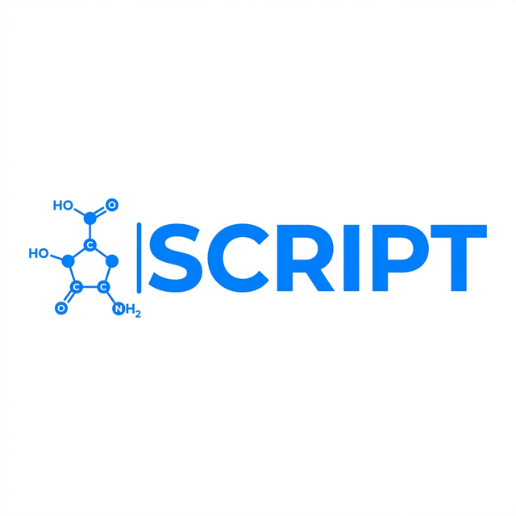

# SCRIPT (Structural Chemical Representation In Plain Text)

SCRIPT: Structural Chemical Representation In Plain Text

<p align="center">
  
</p>

**SCRIPT** is a deterministic, RDKit-independent molecular notation system and cheminformatics engine. Built on a Paninian linguistic model — where grammar rules are chemistry rules — SCRIPT gives every molecule, reaction, material, and quantum state exactly one canonical string.

Not approximately one. One.

### Quick Start

```bash
pip install linearscript
```

```python
import script

# Encode SMILES to canonical SCRIPT
script_str = script.smiles_to_script("CC(=O)Oc1ccccc1C(=O)O")
print(script_str) 
# Output: C(C(=O)O):C(OC(=O)C):C:C:C:C&6:

# Decode SCRIPT to SMILES
smiles = script.script_to_smiles("C(C(=O)O):C(OC(=O)C):C:C:C:C&6:")
```

---

## Why SCRIPT?

SMILES has served chemistry for 35 years. It also has 35-year-old problems:

- **Non-canonical**: The same molecule produces different strings depending on which tool, version, or mood you used
- **Ambiguous rings**: Global labels (`C1...C1`) require tracking open state across the whole string
- **Stereochemistry fragility**: Chirality depends on neighbor ordering, which depends on parse order, which is not guaranteed
- **No validation**: Invalid strings parse silently and blow up later
- **No materials support**: SMILES cannot express alloys, surfaces, spin states, or anything beyond organic chemistry

SCRIPT addresses all of these — not with patches, but at the grammar level:

| Problem | SMILES | SCRIPT V3 |
|---------|--------|-----------|
| Canonicalization | Multiple valid strings | Path-invariant DFS traversal |
| Ring notation | Global labels `C1...C1` | Topological `&N` (local lookback) |
| Ring bond type | Implicit / fragile | Explicit anubandha `&6-` / `&6:` |
| Aromaticity | `c1ccccc1` (lowercase convention) | Anubandha `:` (grammar state) |
| Tautomers | Multiple forms | Mobile bond `=:` |
| Validation | Post-hoc sanitization | Generative Sandhi (real-time) |
| Organometallics | Partial | Dative `->`, coordinate `>`, haptic `*n` |
| Alloys | Not supported | Fractional occupancy `<~0.9>` |
| Crystallography | Not supported | Macroscopic context `[[Rutile]]` |
| Surfaces | Not supported | Phase boundary `\|` |
| Quantum states | Not supported | Spin/excitation `<s:3>`, `<*>` |
| Polymers | Not supported | Stochastic chains `{[CC]}n` |
| Nucleic acids | Not supported | `{dA.m5C.dG.dT}` with 14 modification codes |
| Query atoms | Not supported | `[#6]`, `[R]`, `[!N]`, `[v3]` |
| Typed bonds | Integer order only | `BondType` enum (SINGLE→STAR, 9 values) |
| Stereochemistry types | Tetrahedral only | `@SP`, `@OH`, `@AX`, `@TB`, `@PY` |

---

## Core Innovations

### 1. Deterministic Canonicalization

Morgan-invariant ranking with DFS traversal. One molecule, one string, every time.

```
SMILES: CC(=O)Oc1ccccc1C(=O)O  (one of many valid forms)
SCRIPT: C(C(=O)O):C(OC(=O)C):C:C:C:C&6:  (one and only one)
```

### 2. Topological Ring Closures (`&N`)

Ring closure `&6-` is an instruction: *connect 6 atoms back along the DFS path, via a single bond*. No global state, no unclosed ring errors, no ambiguity.

```
SMILES:  C1CCCCC1         # Global label — tracks open ring 1
SCRIPT:  CCCCCC&6-        # Topological: close aliphatic ring, lookback 6

SMILES:  c1ccccc1         # Aromatic by convention
SCRIPT:  C:C:C:C:C:C&6:  # Explicit aromatic anubandha
```

The anubandha (bond-type marker on the ring closure) is `-` for aliphatic and `:` for aromatic — the same bond symbols used everywhere else in SCRIPT. No new syntax to learn.

### 3. Sandhi Validation (Panini-Inspired)

The generative state machine tracks valence during parsing. Invalid structures are rejected at the bond level, not after construction.

```python
parser.parse("C(C)(C)(C)(C)(C)")  # Rejected: 6-valent carbon
parser.parse("[N+](=O)[O-]")      # Accepted: formal charge adjusts max valence
```

The name comes from Panini's *Ashtadhyayi* — junction rules that govern how morphemes combine. Here they govern how atoms bond.

### 4. CIP-Based Stereochemistry

Chirality is resolved using Cahn-Ingold-Prelog priorities as a universal reference frame. The DFS neighbor order is transformed to CIP space via permutation parity, giving a canonical chiral symbol that doesn't depend on parse order.

```python
# Glucose: four stereocenters, ring, and no ambiguity
SCRIPT: O[C@H]([C@@H]([C@H]([C@@H](C&6-O)O)O)O)CO
# All four centers survive round-trip through CoreMolecule and back
```

Extended stereo types are first-class: `@SP` (square planar), `@OH` (octahedral), `@AX` (axial/allenic), `@TB` (trigonal bipyramidal), `@PY` (pyramidal).

### 5. Typed IR — `BondType` and `StereoType` Enums

The `CoreMolecule` intermediate representation uses enums, not bare integers. A dative bond is `BondType.DATIVE`, not `5`. The IR is self-documenting and safe to serialise independently of RDKit.

```python
from script.mol import BondType, StereoType

BondType.SINGLE     # —  covalent
BondType.DATIVE     # -> donor→acceptor
BondType.TAUTOMERIC # =: mobile bond
BondType.COORDINATE # >  haptic

StereoType.SQUARE_PLANAR    # @SP
StereoType.OCTAHEDRAL       # @OH
StereoType.ATROPISOMER      # @AX  (allenes, biaryls)
```

### 6. RDKit-Independent Core

The parser, canonicalizer, state machine, and IR have zero non-Lark dependencies. RDKit is an optional bridge for interop, not a foundation.

---

## V3: Materials & State Expansion

### Alloys & Non-Stoichiometry

```
Ti<~0.9>N<~0.1>    # Doped titanium nitride
Fe<~0.5>Ni<~0.5>   # Iron-nickel alloy
```

### Crystallography & Polymorphs

```
[[Rutile]] Ti(O)2   # TiO2 rutile phase
[[bcc]] Fe          # Ferrite
[[fcc]] Fe          # Austenite
```

### Surface & Interface Chemistry

```
[[Pt_111]] | >C=O   # CO on platinum 111
[[LiCoO2]] | Li<+>  # Li-ion in battery lattice
```

### Electronic & Excited States

```
O=O<s:3>       # Triplet oxygen
O=O<s:1,*>     # Singlet oxygen (excited)
[C<*>]         # Excited carbon
```

### Polymers

```
{[CC]}n              # Polyethylene (unspecified length)
{[CC]}<n:50-100>     # Stochastic PE, 50–100 repeat units
{[CC]}<n:10>         # Exact 10-mer
```

### Biopolymers — Peptides and Nucleic Acids

```python
# Peptides (20 amino acids + 20 PTM codes)
parser.parse("{A.G.S.K}")           # Ala-Gly-Ser-Lys
parser.parse("{pS.G.acK.V}")        # phosphoSer, acetylLys

# Nucleic acids (DNA, RNA, and 14 epigenetic modification codes)
parser.parse("{dA.dG.dC.dT}")       # DNA strand
parser.parse("{rA.rG.rC.rU}")       # RNA strand
parser.parse("{m5C.dG.dA.dT}")      # DNA methylation (5-methylcytosine)
parser.parse("{m6A.rG.rC.rU}")      # m6A RNA modification
parser.parse("{psU.rG.rC.rA}")      # pseudouridine
```

Supported modification codes: `m5C`, `m6A`, `hm5C`, `f5C`, `ca5C`, `m1A`, `m1G`, `m2G`, `m22G`, `m7G`, `psU`, `s4U`, `I`, `diU`.

---

## Reactions & Salts

```python
# Standard reaction
parser.parse("CC>>CCO")

# Reaction with agents (catalyst/solvent in middle)
parser.parse("CC>[Pd]>CCO")         # returns Reaction(reactants, agents, products)

# Salts and solvates — separator type is preserved
parser.parse("CC.O")                # solvate (fragment_separator='.')
parser.parse("[Na+]~[Cl-]")         # ionic pair (fragment_separator='~')

# Atom mapping
parser.parse("[C:1]=O>>[C:1]O")     # maps C atom across the reaction
```

---

## Query Atoms (Substructure Patterns)

```python
# SMARTS-style query atoms — for substructure search, not canonical output
parser.parse("[#6]CC")     # atomic number 6 (carbon)
parser.parse("[R]CC")      # any ring atom
parser.parse("[r5]CC")     # atom in 5-membered ring
parser.parse("[v3]CC")     # valence = 3
parser.parse("[!N]CC")     # not nitrogen
parser.parse("[a]CC")      # aromatic atom
parser.parse("[#6,#7]C")   # carbon or nitrogen (OR query)

mol = result["molecule"]
atom = mol.atoms[0]
print(atom.is_query)           # True
print(atom.query_atomic_nums)  # [6]
print(atom.query_not)          # False
```

---

## Benchmark Results

| Test suite | Result |
|---|---|
| 10-compound drug benchmark (round-trip InChI) | **10/10** |
| Tier 1 — typed IR features | **14/14** |
| Tier 2 — semantic metadata | **12/12** |
| Tier 3 — query atoms, biopolymers, allenes | **13/13** |
| V3 materials tests | **22/22** |

```bash
python benchmark.py
# Round-trip: 10/10
```

The 10-compound benchmark covers Aspirin, Metformin, Ciprofloxacin·HCl, Nifedipine (nitro group + charged atoms), Ibuprofen, Captopril (proline ring), Glucose (4 stereocenters), Metformin·HCl (salt), Magnesium stearate (metal + multi-fragment), and PVP — chosen to stress-test salts, stereocenters, ring closures, metals, and ionic species simultaneously.

---

## Installation

```bash
# Core engine (RDKit-free)
pip install linearscript

# With RDKit bridge for interop
pip install linearscript[rdkit]
```

---

## Quick Start

### Parsing & Canonicalization

```python
from script.parser import SCRIPTParser
from script.canonical import SCRIPTCanonicalizer

parser = SCRIPTParser()
result = parser.parse("C(C(=O)O):C(OC(=O)C):C:C:C:C&6:")  # Aspirin
mol = result["molecule"]

print(f"Atoms: {len(mol.atoms)}")
print(f"Bonds: {len(mol.bonds)}")

canon = SCRIPTCanonicalizer()
print(canon.canonicalize_core(mol))   # same string back
```

### RDKit Interop

```python
from rdkit import Chem
from script.rdkit_bridge import SCRIPTFromMol, MolFromSCRIPT

mol = Chem.MolFromSmiles("CC(=O)Oc1ccccc1C(=O)O")
script_str = SCRIPTFromMol(mol)
print(script_str)

mol_back = MolFromSCRIPT(script_str)
print(Chem.MolToInchi(mol_back))
```

### Working with the Typed IR

```python
from script.mol import BondType, StereoType, Reaction

# Inspect bond types
result = parser.parse("N->B(F)(F)F")
core = result["molecule"]
print(core.bonds[0].bond_type)          # BondType.DATIVE

# Check stereo type
result = parser.parse("[Pt@SP](Cl)(Cl)([NH3])[NH3]")
atom = result["molecule"].atoms[0]
print(atom.stereo_type)                 # StereoType.SQUARE_PLANAR

# Reaction object
result = parser.parse("CC>[Pd]>CCO")
rxn = result["reaction"]               # Reaction object
print(rxn.reactants, rxn.agents, rxn.products)

# Polymer metadata
result = parser.parse("{[CC]}<n:50-100>")
mol = result["molecule"]
print(mol.repeat_count)                 # (50, 100)

# Fragment separator type
result = parser.parse("[Na+]~[Cl-]")
frags = result["molecule"]
print(frags[1].fragment_separator)     # '~'
```

---

## Project Structure

```
script/
├── script/                    # Core engine (RDKit-free)
│   ├── mol.py                 # CoreAtom / CoreBond / CoreMolecule / BondType / StereoType / Reaction
│   ├── parser.py              # Lark-based SCRIPT parser + interpreter
│   ├── canonical.py           # DFS canonicalization engine
│   ├── chiral.py              # Stereochemistry perception
│   ├── cip.py                 # CIP priority calculator
│   ├── state_machine.py       # Sandhi validation (generative)
│   ├── grammar.lark           # SCRIPT V3 LALR grammar
│   ├── ranking.py             # Morgan invariant ranking
│   ├── local_rings.py         # Topological ring resolution
│   ├── peptide.py             # Biopolymer handler (AA + PTM + nucleotides + mods)
│   └── rdkit_bridge.py        # Optional RDKit interop
├── docs/
│   ├── SPEC.md                # Complete SCRIPT specification
│   ├── CIP_STEREO_THEORY.md   # Stereochemistry reconciliation
│   ├── STANDALONE_ARCHITECTURE.md
│   ├── organic_aromatic_stereo.md
│   ├── metals_organometallics.md
│   ├── materials_polymers_states.md
│   └── reactions_salts_radicals.md
├── tests/
│   ├── test_parser.py
│   └── test_rdkit_integration.py
├── examples/
│   ├── basic_usage.py
│   └── rdkit_demo.py
├── benchmark.py
└── LICENSE
```

---

## Grammar (Abridged)

```
start:              macroscopic_structure
macroscopic_structure: [[context]]? (reaction | script) (| (reaction | script))*
reaction:           script (>> | =>) script
script:             component (. | ~ component)*
component:          molecular_chain | peptide_chain | polymer
molecular_chain:    bond? atom_expr (bond? (atom_expr | local_ring | branch))*
atom_expr:          (ORGANIC_ATOM | [bracket_atom] | [query_atom] | [*] | dhatu) multiplier?
bracket_atom:       [ isotope? element chiral? hcount? charge? radical? ]
query_atom:         query_primitive (, | ; query_primitive)*
query_primitive:    !prim | #INT | R INT? | r INT? | v INT | a | A | ELEMENT
bond:               -> | <- | - | = | # | : | =: | / | \ | > | *INT?
ring_closure:       & INT (- | :)?      # - aliphatic, : aromatic, omitted = single
polymer:            {[ unit ]} (<n:INT> | <n:INT-INT> | n)?
peptide_chain:      { monomer (. monomer)* }
monomer:            AMINO_ACID | PTM_CODE | NUCLEOTIDE | NUC_MOD_CODE
```

The key grammar properties:

- **LALR(1)** — no backtracking, linear parse time
- **No ambiguity** — `&6-` ring closures and `.` fragment separators never collide (dot and dash are distinct tokens in their respective contexts)
- **Lark-based** — grammar is auditable, diffable, and forkable

---

## Comparison

| Feature | SMILES | SELFIES | InChI | SCRIPT V3 |
|---------|--------|---------|-------|-----------|
| Canonical | No* | No | Yes | Yes |
| Human-readable | Yes | No | No | Yes |
| Hand-writable | Yes | No | No | Yes |
| Invalid-proof | No | Yes | N/A | Yes (Sandhi) |
| Stereochemistry | Fragile | Limited | Robust | Robust (CIP) |
| Non-tetrahedral stereo | No | No | Partial | Yes (@SP, @OH, @AX, @TB, @PY) |
| Organometallics | Partial | No | No | Yes |
| Alloys / non-stoichiometric | No | No | No | Yes |
| Crystallography | No | No | Partial | Yes |
| Surfaces / interfaces | No | No | No | Yes |
| Quantum states | No | No | No | Yes |
| Polymers | No | No | No | Yes |
| Nucleotide modifications | No | No | No | Yes (14 codes) |
| Typed bond IR | No | N/A | N/A | Yes (BondType enum) |
| Query atoms | SMARTS only | No | No | Yes |
| RDKit-free core | No | No | N/A | Yes |

*RDKit canonical SMILES is canonical within RDKit. Other toolkits produce different canonical forms.

---

## The "Boss Fights"

To prove that topological back-counting scales to real complexity:

**Taxol (Paclitaxel)** — 11 stereocenters, fused bridged ring system, ester chains, taxane scaffold. Parses and canonicalizes without global ring label tracking.

**Strychnine** — 7 fused rings, 6 stereocenters, the molecule that famously broke several early automated structure elucidation systems. SCRIPT handles it with local ring closures and CIP stereo.

**Glucose** — 4 stereocenters, pyranose ring, both anomers distinguishable. The stereo round-trip test that caught the R↔S inversion bug during development.

---

## Known Limitations

- **Allenic stereo** — allene centres are detected and tagged `@AX`, but the stereo *bit* (Ra/Sa) cannot be populated from RDKit without 3D coordinates. The structural feature is recorded; the specific handedness requires geometry.
- **Block copolymers** — `{[CC]}-b-{[styrene]}` junction notation is parsed but not yet expanded to atoms.
- **Periodic structures** — MOFs, zeolites, unit cell connectivity. The `[[context]]` and `<~0.9>` occupancy system starts here but true periodic topology needs an adjacency model that does not yet exist.
- **SMARTS-SCRIPT** — the query atom grammar covers `[#6]`, `[R]`, `[!N]`, `[v3]`, `[a]`, `[A]`. The full SMARTS feature set (`[$(...)],` recursive SMARTS, etc.) is out of scope for a representation standard; use RDKit SMARTS for that.

---

## Citation

```
SCRIPT: Structural Chemical Representation In Plain Text. 
Sharma, S. (2026). 
https://github.com/sangeet01/script
```

---

## License

**MIT License with Commons Clause**

Free for academic research, personal projects, and non-commercial open-source development. Commercial use requires a separate licensing agreement.

---

## Contributing

1. Fork the repo
2. Create a feature branch
3. Add tests — the benchmark suite is the ground truth
4. Submit a pull request

See `docs/SPEC.md` for the full grammar specification and `docs/CIP_STEREO_THEORY.md` for the stereochemistry reconciliation theory.

---

*"A linear script to unfold molecular complexity — from the singlet to the surface."*

---

PS: Sangeet's the name, a daft undergrad splashing through chemistry and code like a toddler; my titrations are a mess, and I've used my mouth to pipette.
